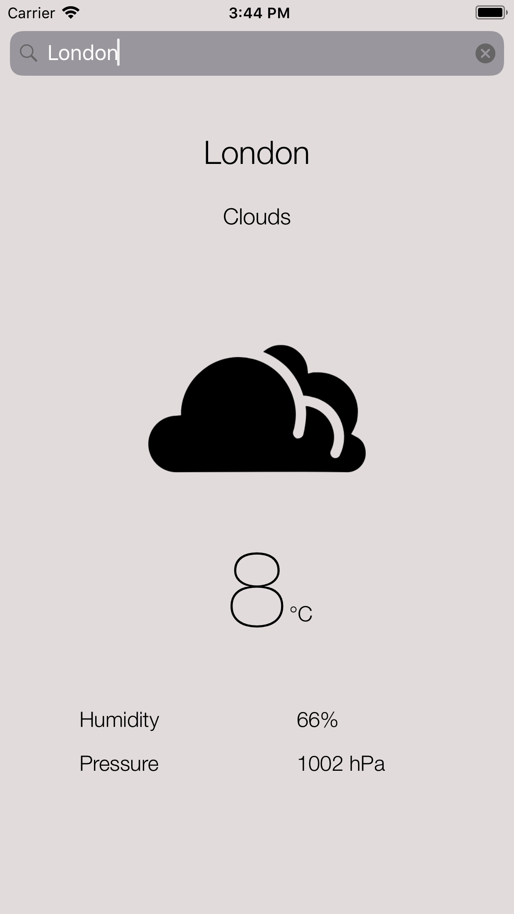

#  WeatherAPP_Frontend (Swift)

*This Swift App uses the API service that I built [here.](https://github.com/mfazari/WeatherApp_Backend)*

Introduction
------------

This is an HTTP service which provides an API to get a weather
forecast for a given place.

Getting it running
------------------

1. Switch to directory and install pod files
2. Open new created file ".xcworkspace" file in Xcode
3. run code

Sneak Peek
------------------

Copyright
------------
Massimo Fazari 2020.
